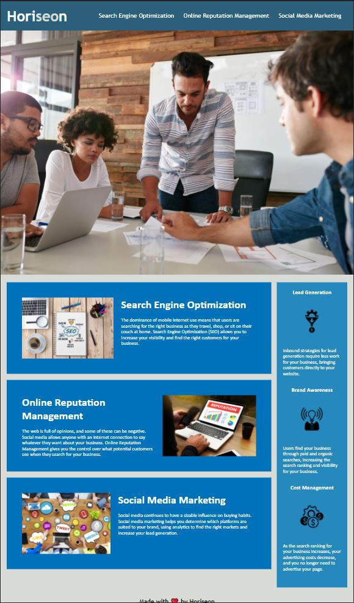

# challenge1 HTML CSS Git Challenge: Code Refactor

## User Story

AS A marketing agency
I WANT a codebase that follows accessibility standards
SO THAT our own site is optimized for search engines

## Acceptance Criteria

* A webpage meets accessibility standards

* Semantic HTML elements

* The HTML elements follow a logical structure independent of styling and positioning

* Image elements have accessible alt attributes

* Heading attributes fall in sequential order

* A concise, descriptive title

* Functioning navigation section

* Consolidated CSS selectors that follow the semantic HTML elements

* Commenting in HTML and CSS files

## Assets

The following image demonstrates the web application's appearance and functionality:

---
© 2021 2019 Horiseon Social Solution Services, Inc. Confidential and Proprietary. All Rights Reserved.
